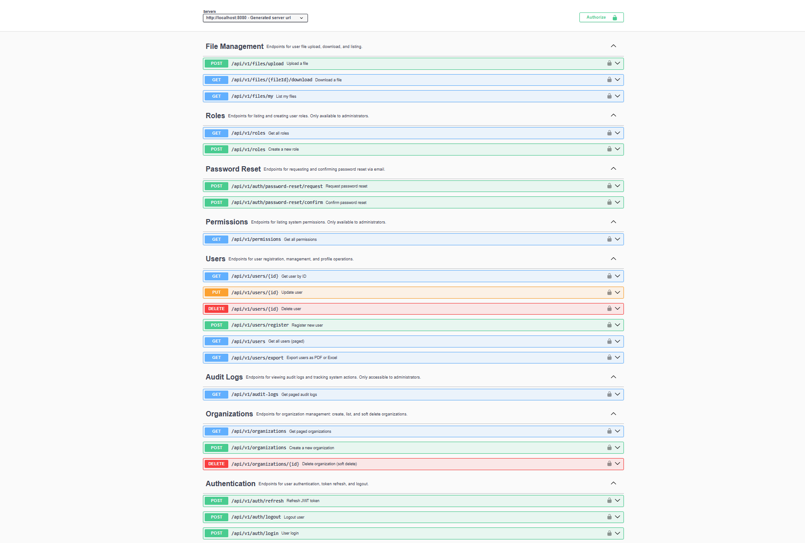
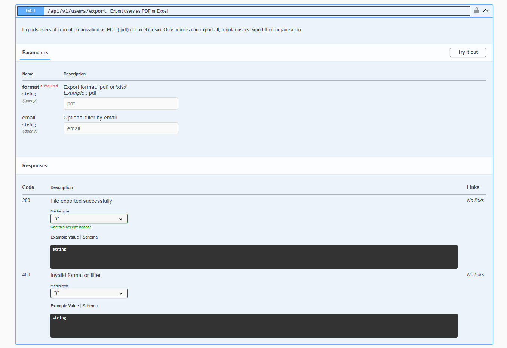
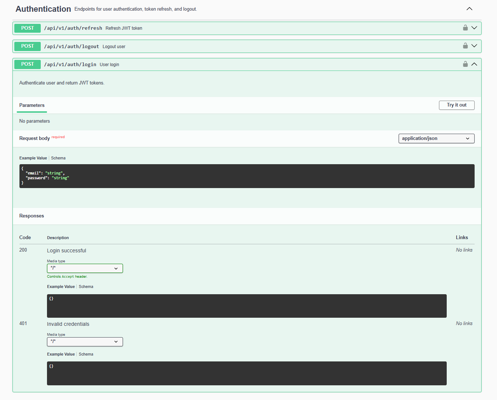
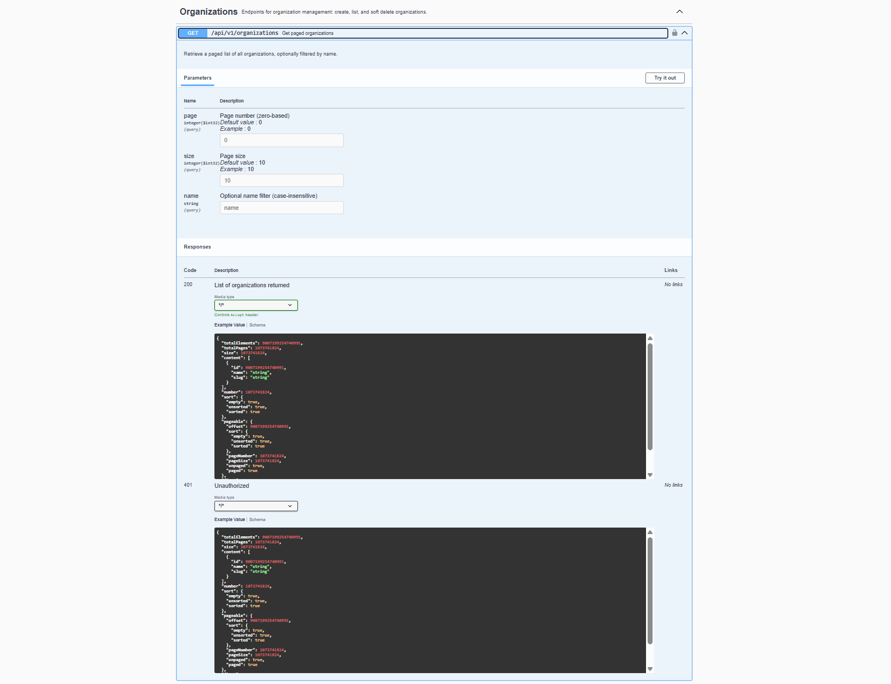

# saas-backend-starter

> ⚠️ **Note:** This project demonstrates fully functional, production-grade engineering practices, and is published for portfolio and educational purposes.
> While the codebase is complete and runnable, it is not intended for direct production use without additional security review, infrastructure improvements, and deployment hardening.

This codebase is curated and maintained by Uros, a backend engineer specializing in enterprise Java/Spring Boot solutions.  
It demonstrates best practices in modern backend architecture, secure API design, and production-quality engineering.

This repository presents a **complete, multi-tenant SaaS backend platform** suitable for real-world business automation, team collaboration, and data management use cases.  
It showcases how to architect, document, and secure a Java backend following the highest enterprise standards.

---

## Features

- 📊 **REST API** with [Swagger/OpenAPI](#api-documentation) documentation  
- 🔒 **Custom JWT authentication & authorization**  
- 🛡️ **Role-based and permission-based access control** (RBAC & PBAC)  
- 🚀 **Modular, domain-driven design** (DDD): clear separation into controller, service, repository, DTO, domain, and config layers  
- 👥 **User, Organization, Role, Permission, and AuditLog entities**  
- 📝 **Audit/event logging** with multi-tenant context  
- 👤 **User registration, password reset (with token flow), and soft deletion**  
- 📁 **File upload/download**: per-user & per-organization file storage  
- 🔔 **Real-time notifications** via **STOMP/WebSocket** with secure JWT handshake  
- 🌍 **Advanced exception handling** with full localization (i18n, multi-language support)  
- ❤️ **Health checks** with custom [Spring Boot Actuator](https://docs.spring.io/spring-boot/docs/current/reference/html/actuator.html) indicators  
- 🛡️ **Fully integrated with Spring Security 6+**  
- 🧑‍💻 **Sample data loader** for demoing roles, permissions, and admin user  
- 🐳 **Docker-ready**, intended for rapid onboarding and demo use

---

## Technologies

- **Java 21+**
- **Spring Boot 3.5+**
- **Spring Security, Spring Data JPA**
- **MariaDB/MySQL**
- **Swagger / OpenAPI 3**
- **Lombok**
- **Maven** (build tool)
- **Docker** (containerization support)

> The project is easily adaptable to PostgreSQL and Gradle on request.

---

## 🟢 Runnable Demo – Quick Start

This project is a fully runnable Spring Boot backend.
You can clone the repository, build the app, and launch all services using Docker Compose.

**Instructions:**

1. **Start all services (build and run everything in Docker):**
    ```bash
    docker-compose up --build
    ```

- The backend API will be available at [http://localhost:8080](http://localhost:8080).
- **Swagger UI:** [http://localhost:8080/swagger-ui/index.html](http://localhost:8080/swagger-ui/index.html)
- MariaDB runs on port **3307** (container: 3306).
- Default admin user and demo data are loaded automatically on first run.
- Uploaded files are saved to the `uploads/` directory (excluded from git).
- All demo credentials and secrets are for **local/testing only**.

> For production-grade deployment or additional integrations, contact me.

---

## Helper Script (Linux / MacOS)

If you are on Linux or MacOS, you can use the included helper script to automate the build and startup process:

```
./run-demo.sh
```

Tip: If you get a "Permission denied" error, make the script executable:

```
chmod +x run-demo.sh
```

---

## Windows users

If you are on Windows, you can use the included helper script:

```cmd
run-demo.cmd
```

---

## Internationalization (i18n) Support

All user-facing messages, errors, and API responses are fully localized.  
The system comes with built-in support for **English, Serbian, and German**, and is easily extensible to any language by simply adding new message property files (e.g., `messages_fr.properties`).

- **Dynamic locale detection** based on user/browser preference or Accept-Language header.
- All validation errors, business exceptions, and success messages are localized.
- Extend or override messages without touching code.

> See `src/main/resources/messages*.properties` for sample translations.

---

## ⚠️ Portfolio / Demo Notice

This repository is published strictly for portfolio and demonstration purposes.  

- It is fully runnable locally for demo purposes, but it is not a production-ready deployment.
- This repository contains the entire backend codebase as used for local development, demo, and portfolio review. It is not intended as a ready-made production deployment, but as a comprehensive reference implementation.
- All secrets and credentials are intentionally omitted and should never be committed to version control.

---

## Database Schema Auto-Update

For demo and portfolio purposes, this project is configured with:

    spring.jpa.hibernate.ddl-auto=update

This enables automatic schema update on application startup.

> ⚠️ **Production Usage Warning**  
>
> - In any real production environment, database schema management **must** be handled via migration tools such as [Flyway](https://flywaydb.org/) or [Liquibase](https://www.liquibase.org/).
> - The `ddl-auto` property should be set to `validate` (or `none`) to prevent accidental schema changes.
> - All credentials and secrets **must** be provided via secure mechanisms and **never committed to version control**.
>
> This configuration is **intentional**, to simplify code review and enable easy local setup for demo purposes only.
>
> **Do not use this configuration in production.**

---

## API Documentation

All endpoints are fully documented using Swagger/OpenAPI.  
Below are example screenshots from the live Swagger UI:

### Swagger UI Screenshots


*Complete API listing – all grouped endpoints at a glance.*


*Detailed export endpoint: file format selection, filtering, and response codes.*


*User login: required fields, request/response format, error handling.*


*Paged organizations list: pagination, filtering, and full response example.*


- User Management endpoints overview
- Create User endpoint detail
- Role & Permission Management
- Audit Log querying
- Organization management

---

**Example: User Authentication (Login)**
```http
POST /api/v1/auth/login
Content-Type: application/json

{
  "email": "admin@demo.com",
  "password": "admin12345"
}
```

**Response:**
```json
{
  "accessToken": "...",
  "refreshToken": "...",
  "tokenType": "Bearer"
}
```

**Example: Register New User**
```http
POST /api/v1/users/register
Content-Type: application/json

{
  "email": "johndoe@example.com",
  "password": "Secret123",
  "fullName": "John Doe"
}
```
## Project Structure

```
src/
    main/
        java/
            com/
                urke/
                    saasbackendstarter/
                        audit/
                        config/
                        controller/
                        domain/
                        dto/
                            auth/
                            user/
                            organization/
                            // Other DTOs (e.g., AuditLogDTO, NotificationMessage, etc.)
                        events/
                        exception/
                        health/
                        mapper/
                        repository/
                        security/
                        service/
                            impl/
        resources/
            messages.properties
            messages_sr.properties
            messages_de.properties
            application.yaml
    test/
        java/
            com/
                urke/
                    saasbackendstarter/
                        // Unit and integration test classes
        resources/
pom.xml
README.md
docker-compose.yml
Dockerfile
run-demo.sh
run-demo.cmd
mvnw
mvnw.cmd
.gitignore
```

---

## Test Coverage

This codebase follows industry best practices for testing and code quality.

- All key REST controllers (User, Role, Permission, Organization, Audit, Auth) are covered with dedicated unit tests using `@WebMvcTest` and `@MockBean`.
- Core service logic is tested for main business flows (e.g., user/role/organization management).
- Exception handling and validation edge cases are covered with controller and global handler tests.
- Audit logging and domain events are included in test scenarios.
- All tests are runnable out of the box (`mvn test`), without any external setup.
- The test directory structure mirrors the main package layout for clarity.

> Full coverage reports (Jacoco) available on request or can be generated locally.

Example test output (all green):

```bash
mvn test
# ...
# Tests run: 10, Failures: 0, Errors: 0, Skipped: 0
```
---

## Key Architecture Highlights

- **Clean layering:** Controller → Service → Repository, high cohesion and loose coupling.
- **Modular design:** DDD style, each concern isolated for maintainability.
- **JWT Security:** Stateless, with granular method-level access control (`@PreAuthorize`).
- **Multi-tenancy:** All user and audit data is scoped to organizations.
- **Audit/Event System:** All sensitive operations are tracked with org/user context.
- **File Management:** User/org file upload & download with security checks.
- **i18n (Internationalization):** All errors/messages localized via MessageSource and `messages.properties`.
- **Centralized Exception Handling:** Custom exceptions per domain, API-friendly error DTOs, and localization.
- **Swagger/OpenAPI:** Each controller method includes `@Operation`, `@ApiResponse` annotations.
- **WebSocket (STOMP):** Real-time notifications, secured by JWT handshake interceptor.
- **Startup Data Loader:** Demo roles, permissions, and admin user created at first run (in dev/demo profile).
- **Health/Monitoring:** Spring Boot Actuator endpoints + custom indicator for external API connectivity.

---

## Portfolio & Contact

For technical deep-dive, architecture consultations, or backend contract work, contact via  
[Upwork](https://www.upwork.com/freelancers/~01fec0932cf5314b14) or [LinkedIn](https://www.linkedin.com/in/uros-ilic-6a201436a/).

## License

This project is licensed under the MIT License. See the [LICENSE](./LICENSE) file for details.

## Contribution

This is a personal portfolio project; **external contributions are not being accepted** at this time.

---
